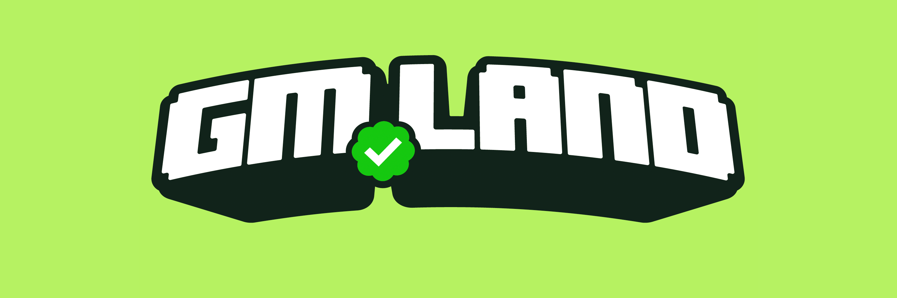

# Introduction

<figure><figcaption></figcaption></figure>

**GM.Land is a decentralising social ecosystem built on top of virtual land.**


**This litepaper is a living document and is subject to major changes in a matter of days or even hours. We therefore document our though process in a version tracked system in the name of high transparency.**


We say _decentralising_ 😁 since, we admit, we will not be fully decentralised at the start - eg. the team, the technical infrastructure. But hear us out as we reveal our plans to fully decentralise in this litepaper.

GM.Land is community-driven NFT project that enables users to own and customise virtual land on a pixel map, represented as unique Land NFTs.&#x20;

<figure><figcaption>
World Map
</figcaption></figure>

The pixel map serves as a web3 billboard (above), allowing user to upload images or logos to their land, effectively creating a personalised advertising space. Additionally, when a user's land is selected, a personal social media space launches (below), featuring the user's avatar and a custom room. The platform plans to incorporate basic features like guest books, posts, and likes to enhance the user experience.

<figure><figcaption>
Room View
</figcaption></figure>

The project incorporates a community treasury and governance tokens called Checks (ERC-1155). Users can burn multiple Checks to claim Land NFTs (ERC-721) with varying sizes and unique X, Y coordinates. GM.Land is committed to donating a portion of its revenue to planting trees and fostering a sustainable future.

It is intended, at the time of writing that GM.Land will be deployed on Polygon which claims to be a carbon-neutral blockchain.
