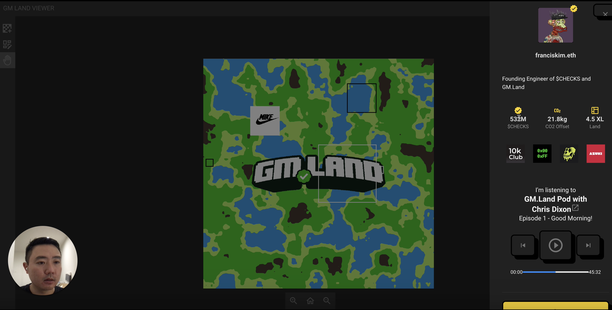

# Social Media Features

<figure><figcaption>
Artist's First Impression - this will change
</figcaption></figure>

GM.Land is a decentralised social ecosystem built on top of digital land that features web3-centric social media functionalities. While this current image of the social media UI will change, the core idea is nicely demonstrated.

At the time of launch, the features we intend to launch with are:

* Ability to select up to 3 Communities (NFT collections) that you feel you're a part of
  * This feature will link with the [Permissionless Referral System](permissionless-referral-system.md)
* Ability to customise room with a selection of furnitures and goods
* Guestbook
* Post (text only at launch)
* Like
* Ability to link Discord Username, Twitter Handle
