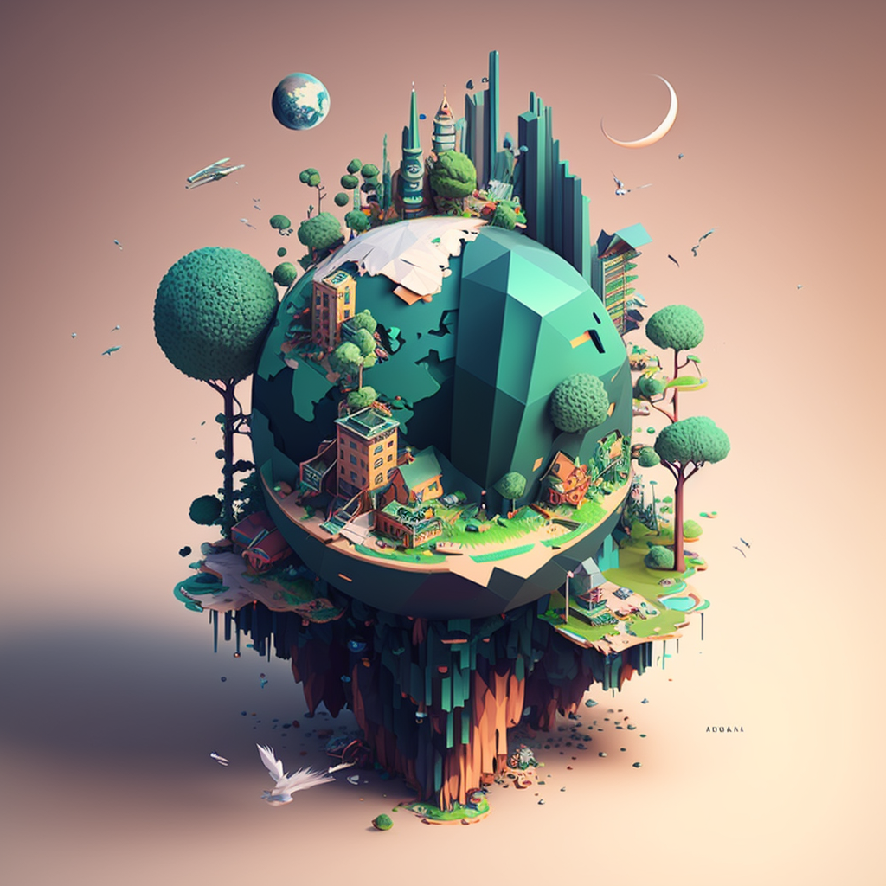

# Sustainability & Safety in Web3

NFT projects have traditionally been mostly about the hype; the grind to get on the allowed list, minting with the hopes of seeing the floor price sky rocket, supported by a low supply of tokens, generally under 10,000.

This model is very similar to the super-hyped sneaker releases where the vast majority of interested buyers will have to pay a premium to buy from a reseller at 2X, 3X or at name-your-X the retail price.

There is a problem with this model and it doesn't quite go with the core ethos or promise of decentralisation, in fact, it's quite the opposite - it is as if the model was designed to benefit only a small number of users. It is exclusive and seems mostly about the floor price.

It's very disheartening to take wind of a promising project on Twitter or Discord, only to find out the  project does not even allow a read-only look for those without a token. At this point, the usual thing to do is to head to OpenSea to see what the tokens are selling for and it's generally a binary outcome: it's either heading to zero or you're priced out.

[Community wars](https://twitter.com/waleswoosh/status/1637790583170248705) could be a side effect of exclusive NFT communities. We at GM.Land want to make the project inclusive, its features accessible to all - allow non-token holders to still view the entire project (read-only) and token holders to obviously fully participate (read/write) for an extremely affordable price of $8 or less for a lifetime pass.

<figure><figcaption>
AI generated image via Midjourney v4. Prompt: "pixel world".
</figcaption></figure>
